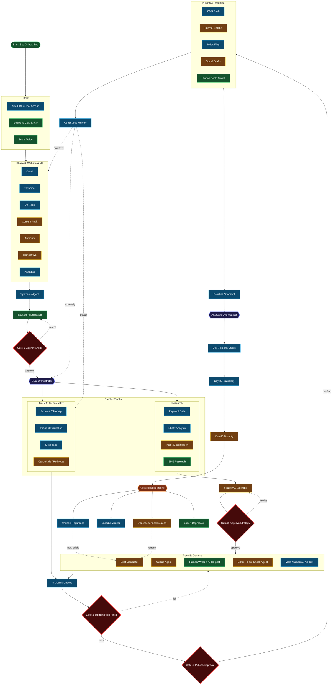

# Flowchart: As-Is — Agentic Human SEO Workflow

```mermaid
flowchart TD
    classDef ai fill:#0c4a6e,stroke:#38bdf8,color:#f0f9ff
    classDef hybrid fill:#713f12,stroke:#facc15,color:#fefce8
    classDef human fill:#14532d,stroke:#4ade80,color:#f0fdf4
    classDef gate fill:#450a0a,stroke:#ef4444,stroke-width:3px,color:#fef2f2
    classDef brain fill:#1e1b4b,stroke:#818cf8,stroke-width:3px,color:#eef2ff
    classDef checkpoint fill:#7c2d12,stroke:#fb923c,stroke-width:3px,color:#fff7ed

    START([Start: Site Onboarding]):::human

    subgraph INPUT["Input"]
        I1[Site URL & Tool Access]:::ai
        I2[Business Goal & ICP]:::human
        I3[Brand Voice]:::human
    end

    subgraph AUDIT["Phase 0: Website Audit"]
        A1[Crawl]:::ai
        A2[Technical]:::ai
        A3[On-Page]:::ai
        A4[Content Audit]:::hybrid
        A5[Authority]:::hybrid
        A6[Competitive]:::hybrid
        A7[Analytics]:::ai
    end

    SYN[Synthesis Agent]:::ai
    PRIO[Backlog Prioritization]:::human
    G1{Gate 1: Approve Audit}:::gate
    ORCH{{SEO Orchestrator}}:::brain

    subgraph PARALLEL["Parallel Tracks"]
        direction LR
        subgraph RESEARCH["Research"]
            R1[Keyword Data]:::ai
            R2[SERP Analysis]:::ai
            R3[Intent Classification]:::hybrid
            R4[SME Research]:::human
        end
        subgraph FIXA["Track A: Technical Fix"]
            F1[Schema / Sitemap]:::ai
            F2[Image Optimization]:::ai
            F3[Meta Tags]:::ai
            F4[Canonicals / Redirects]:::hybrid
        end
    end

    STRAT[Strategy & Calendar]:::hybrid
    G2{Gate 2: Approve Strategy}:::gate

    subgraph CONTENT["Track B: Content"]
        C1[Brief Generator]:::hybrid
        C2[Outline Agent]:::hybrid
        C3[Human Writer + AI Co-pilot]:::human
        C4[Editor + Fact-Check Agent]:::hybrid
        C5[Meta / Schema / Alt-Text]:::ai
    end

    QA[AI Quality Checks]:::ai
    G3{Gate 3: Human Final Read}:::gate
    G4{Gate 4: Publish Approval}:::gate

    subgraph PUB["Publish & Distribute"]
        P1[CMS Push]:::ai
        P2[Internal Linking]:::hybrid
        P3[Index Ping]:::ai
        P4[Social Drafts]:::hybrid
        P5[Human Posts Social]:::human
    end

    SNAP[Baseline Snapshot]:::ai
    AORCH{{Aftercare Orchestrator}}:::brain

    D7[Day 7 Health Check]:::ai
    D30[Day 30 Trajectory]:::ai
    D90[Day 90 Maturity]:::hybrid
    CLASS{{Classification Engine}}:::checkpoint

    WIN[Winner: Repurpose]:::ai
    STEADY[Steady: Monitor]:::ai
    UNDER[Underperformer: Refresh]:::hybrid
    LOSE[Loser: Deprecate]:::human

    MON[Continuous Monitor]:::ai

    START --> INPUT
    INPUT --> AUDIT
    AUDIT --> SYN --> PRIO --> G1
    G1 -->|approve| ORCH
    G1 -.->|reject| PRIO

    ORCH --> RESEARCH
    ORCH --> FIXA
    RESEARCH --> STRAT --> G2
    G2 -->|approve| CONTENT
    G2 -.->|revise| STRAT

    FIXA --> QA
    CONTENT --> QA
    QA --> G3
    G3 -->|pass| G4
    G3 -.->|fail| CONTENT

    G4 -->|confirm| PUB
    PUB --> SNAP --> AORCH
    PUB --> MON

    AORCH --> D7 --> D30 --> D90 --> CLASS
    CLASS --> WIN
    CLASS --> STEADY
    CLASS --> UNDER
    CLASS --> LOSE

    WIN -.->|new briefs| C1
    UNDER -.->|refresh| C1
    MON -.->|anomaly| ORCH
    MON -.->|decay| FIXA
    MON -.->|quarterly| AUDIT
```
