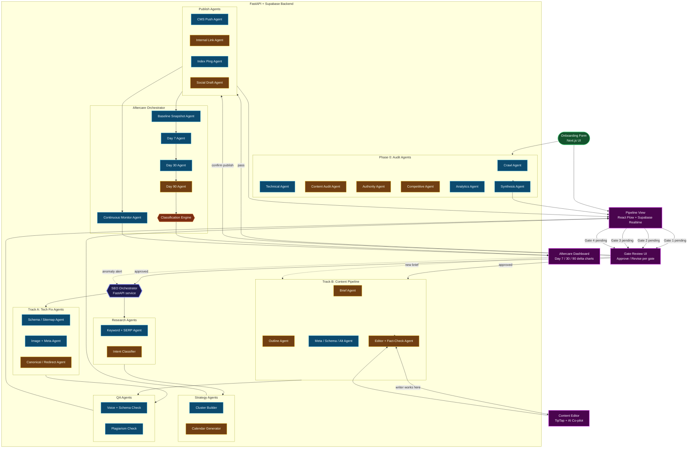

# Flowchart: To-Be — Agentic Human SEO Workflow with Next.js UI Layer

Color key: GREEN = fully automated | BLUE = AI-augmented | DEFAULT = human | RED border = approval gate | PURPLE = UI screen

```mermaid
flowchart TD
    classDef ai fill:#0c4a6e,stroke:#38bdf8,color:#f0f9ff
    classDef hybrid fill:#713f12,stroke:#facc15,color:#fefce8
    classDef human fill:#14532d,stroke:#4ade80,color:#f0fdf4
    classDef gate fill:#450a0a,stroke:#ef4444,stroke-width:3px,color:#fef2f2
    classDef brain fill:#1e1b4b,stroke:#818cf8,stroke-width:3px,color:#eef2ff
    classDef ui fill:#4a044e,stroke:#d946ef,stroke-width:2px,color:#fdf4ff
    classDef checkpoint fill:#7c2d12,stroke:#fb923c,color:#fff7ed

    UI_PIPELINE[Pipeline View\nReact Flow + Supabase Realtime]:::ui
    UI_GATE[Gate Review UI\nApprove / Revise per gate]:::ui
    UI_EDITOR[Content Editor\nTipTap + AI Co-pilot]:::ui
    UI_DASH[Aftercare Dashboard\nDay 7 / 30 / 90 delta charts]:::ui

    START([Onboarding Form\nNext.js UI]):::human
    START --> UI_PIPELINE

    subgraph BACKEND["FastAPI + Supabase Backend"]
        direction TB

        subgraph AUDIT_LAYER["Phase 0: Audit Agents"]
            A1[Crawl Agent]:::ai
            A2[Technical Agent]:::ai
            A3[Content Audit Agent]:::hybrid
            A4[Authority Agent]:::hybrid
            A5[Competitive Agent]:::hybrid
            A6[Analytics Agent]:::ai
            SYN[Synthesis Agent]:::ai
        end

        ORCH{{SEO Orchestrator\nFastAPI service}}:::brain

        subgraph RESEARCH_LAYER["Research Agents"]
            R1[Keyword + SERP Agent]:::ai
            R2[Intent Classifier]:::hybrid
        end

        subgraph STRAT_LAYER["Strategy Agents"]
            S1[Cluster Builder]:::ai
            S2[Calendar Generator]:::hybrid
        end

        subgraph TECHNICAL_LAYER["Track A: Tech Fix Agents"]
            F1[Schema / Sitemap Agent]:::ai
            F2[Image + Meta Agent]:::ai
            F3[Canonical / Redirect Agent]:::hybrid
        end

        subgraph CONTENT_LAYER["Track B: Content Pipeline"]
            C1[Brief Agent]:::hybrid
            C2[Outline Agent]:::hybrid
            C3[Editor + Fact-Check Agent]:::hybrid
            C4[Meta / Schema / Alt Agent]:::ai
        end

        subgraph QA_LAYER["QA Agents"]
            QA1[Voice + Schema Check]:::ai
            QA2[Plagiarism Check]:::ai
        end

        subgraph PUB_LAYER["Publish Agents"]
            P1[CMS Push Agent]:::ai
            P2[Internal Link Agent]:::hybrid
            P3[Index Ping Agent]:::ai
            P4[Social Draft Agent]:::hybrid
        end

        subgraph AFTERCARE_LAYER["Aftercare Orchestrator"]
            SNAP[Baseline Snapshot Agent]:::ai
            D7[Day 7 Agent]:::ai
            D30[Day 30 Agent]:::ai
            D90[Day 90 Agent]:::hybrid
            CLASS{{Classification Engine}}:::checkpoint
            MON[Continuous Monitor Agent]:::ai
        end
    end

    START --> AUDIT_LAYER
    AUDIT_LAYER --> SYN
    SYN --> UI_PIPELINE

    UI_PIPELINE -->|Gate 1 pending| UI_GATE
    UI_GATE -->|approved| ORCH

    ORCH --> RESEARCH_LAYER --> STRAT_LAYER
    ORCH --> TECHNICAL_LAYER

    STRAT_LAYER --> UI_PIPELINE
    UI_PIPELINE -->|Gate 2 pending| UI_GATE
    UI_GATE -->|approved| CONTENT_LAYER

    CONTENT_LAYER --> C3
    C3 <-->|writer works here| UI_EDITOR
    UI_EDITOR --> C3

    TECHNICAL_LAYER --> QA_LAYER
    CONTENT_LAYER --> QA_LAYER

    QA_LAYER --> UI_PIPELINE
    UI_PIPELINE -->|Gate 3 pending| UI_GATE
    UI_GATE -->|pass| PUB_LAYER

    PUB_LAYER --> UI_PIPELINE
    UI_PIPELINE -->|Gate 4 pending| UI_GATE
    UI_GATE -->|confirm publish| PUB_LAYER

    PUB_LAYER --> SNAP --> D7 --> D30 --> D90 --> CLASS
    CLASS --> UI_DASH
    PUB_LAYER --> MON --> UI_DASH

    UI_DASH -.->|new brief| CONTENT_LAYER
    UI_DASH -.->|anomaly alert| ORCH
```
