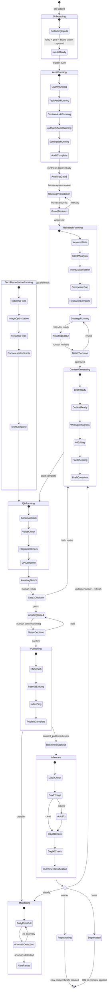

# State Diagram: As-Is — Agentic Human SEO Workflow

```mermaid
stateDiagram-v2
    [*] --> Onboarding: site added

    state Onboarding {
        [*] --> CollectingInputs
        CollectingInputs --> InputsReady: URL + goal + brand voice captured
    }

    InputsReady --> AuditRunning: trigger audit

    state AuditRunning {
        [*] --> CrawlRunning
        CrawlRunning --> TechAuditRunning
        TechAuditRunning --> ContentAuditRunning
        ContentAuditRunning --> AuthorityAuditRunning
        AuthorityAuditRunning --> SynthesisRunning
        SynthesisRunning --> AuditComplete
    }

    AuditComplete --> AwaitingGate1: synthesis report ready
    AwaitingGate1 --> BacklogPrioritization: human opens review
    BacklogPrioritization --> Gate1Decision: human submits

    state Gate1Decision <<choice>>
    Gate1Decision --> ResearchRunning: approved
    Gate1Decision --> BacklogPrioritization: rejected

    state ResearchRunning {
        [*] --> KeywordData
        KeywordData --> SERPAnalysis
        SERPAnalysis --> IntentClassification
        IntentClassification --> CompetitorGap
        CompetitorGap --> ResearchComplete
    }

    ResearchRunning --> TechRemediationRunning: parallel track
    ResearchComplete --> StrategyRunning

    state TechRemediationRunning {
        [*] --> SchemaFixes
        SchemaFixes --> ImageOptimization
        ImageOptimization --> MetaTagFixes
        MetaTagFixes --> CanonicalsRedirects
        CanonicalsRedirects --> TechComplete
    }

    StrategyRunning --> AwaitingGate2: calendar ready

    AwaitingGate2 --> Gate2Decision: human reviews
    state Gate2Decision <<choice>>
    Gate2Decision --> ContentGenerating: approved
    Gate2Decision --> StrategyRunning: revise

    state ContentGenerating {
        [*] --> BriefReady
        BriefReady --> OutlineReady
        OutlineReady --> WritingInProgress
        WritingInProgress --> AIEditing
        AIEditing --> FactChecking
        FactChecking --> DraftComplete
    }

    TechComplete --> QARunning
    ContentGenerating --> QARunning: draft complete

    state QARunning {
        [*] --> SchemaCheck
        SchemaCheck --> VoiceCheck
        VoiceCheck --> PlagiarismCheck
        PlagiarismCheck --> QAComplete
    }

    QAComplete --> AwaitingGate3
    AwaitingGate3 --> Gate3Decision: human reads

    state Gate3Decision <<choice>>
    Gate3Decision --> AwaitingGate4: pass
    Gate3Decision --> ContentGenerating: fail - revise

    AwaitingGate4 --> Gate4Decision: human confirms timing
    state Gate4Decision <<choice>>
    Gate4Decision --> Publishing: confirm
    Gate4Decision --> AwaitingGate4: hold

    state Publishing {
        [*] --> CMSPush
        CMSPush --> InternalLinking
        InternalLinking --> IndexPing
        IndexPing --> PublishComplete
    }

    Publishing --> BaselineSnapshot: content_published event

    state Aftercare {
        [*] --> Day7Check
        Day7Check --> Day7Triage
        Day7Triage --> Day30Check: clear
        Day7Triage --> AutoFix: issues
        AutoFix --> Day30Check
        Day30Check --> Day90Check
        Day90Check --> OutcomeClassification
    }

    BaselineSnapshot --> Aftercare
    Publishing --> Monitoring: parallel

    state Monitoring {
        [*] --> DailyDataPull
        DailyDataPull --> AnomalyDetection
        AnomalyDetection --> DailyDataPull: no anomaly
        AnomalyDetection --> AlertRaised: anomaly detected
    }

    state OutcomeRouting <<choice>>
    Aftercare --> OutcomeRouting

    OutcomeRouting --> Repurposing: winner
    OutcomeRouting --> Monitoring: steady
    OutcomeRouting --> ContentGenerating: underperformer - refresh
    OutcomeRouting --> Deprecated: loser

    Repurposing --> [*]: new content briefs created
    Deprecated --> [*]: 301 or noindex applied
```
