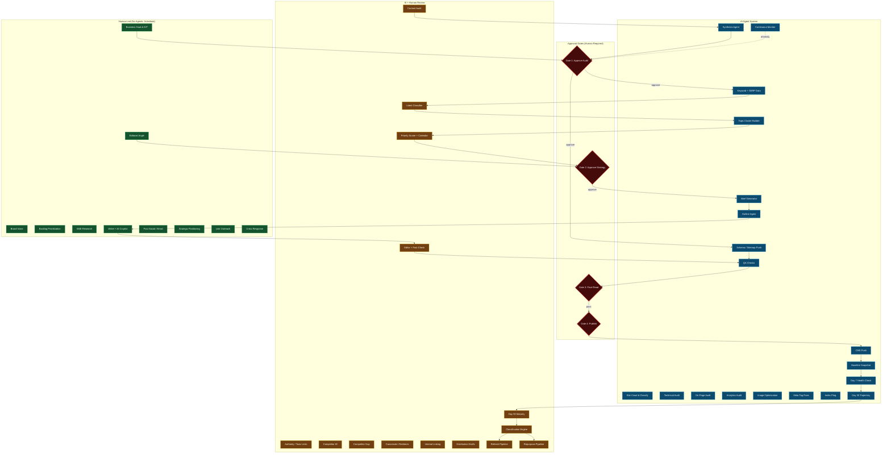

# Swimlane: As-Is — Agentic Human SEO Workflow

```mermaid
flowchart TD
    classDef ai fill:#0c4a6e,stroke:#38bdf8,color:#f0f9ff
    classDef hybrid fill:#713f12,stroke:#facc15,color:#fefce8
    classDef human fill:#14532d,stroke:#4ade80,color:#f0fdf4
    classDef gate fill:#450a0a,stroke:#ef4444,stroke-width:3px,color:#fef2f2
    classDef brain fill:#1e1b4b,stroke:#818cf8,stroke-width:3px,color:#eef2ff

    subgraph AI["AI Agent System"]
        direction TB
        A_crawl[Site Crawl & Classify]:::ai
        A_tech[Technical Audit]:::ai
        A_onpage[On-Page Audit]:::ai
        A_analytics[Analytics Audit]:::ai
        A_syn[Synthesis Agent]:::ai
        A_kw[Keyword + SERP Data]:::ai
        A_cluster[Topic Cluster Builder]:::ai
        A_schema[Schema / Sitemap Push]:::ai
        A_img[Image Optimization]:::ai
        A_meta_fix[Meta Tag Fixes]:::ai
        A_brief[Brief Generator]:::ai
        A_outline[Outline Agent]:::ai
        A_qa[QA Checks]:::ai
        A_cms[CMS Push]:::ai
        A_ping[Index Ping]:::ai
        A_snap[Baseline Snapshot]:::ai
        A_d7[Day 7 Health Check]:::ai
        A_d30[Day 30 Trajectory]:::ai
        A_mon[Continuous Monitor]:::ai
    end

    subgraph HYBRID["AI + Human Review"]
        direction TB
        H_content[Content Audit]:::hybrid
        H_authority[Authority / Toxic Links]:::hybrid
        H_competitor[Competitor ID]:::hybrid
        H_intent[Intent Classifier]:::hybrid
        H_gap[Competitor Gap]:::hybrid
        H_canon[Canonicals / Redirects]:::hybrid
        H_strategy[Priority Scorer + Calendar]:::hybrid
        H_editor[Editor + Fact-Check]:::hybrid
        H_link[Internal Linking]:::hybrid
        H_social[Distribution Drafts]:::hybrid
        H_d90[Day 90 Maturity]:::hybrid
        H_classify[Classification Engine]:::hybrid
        H_refresh[Refresh Pipeline]:::hybrid
        H_repurpose[Repurpose Pipeline]:::hybrid
    end

    subgraph HUMAN["Human-Led (No Agentic Substitute)"]
        direction TB
        P_goal[Business Goal & ICP]:::human
        P_voice[Brand Voice]:::human
        P_prio[Backlog Prioritization]:::human
        P_sme[SME Research]:::human
        P_angle[Editorial Angle]:::human
        P_write[Writer + AI Co-pilot]:::human
        P_social[Post Social / Email]:::human
        P_strat[Strategic Positioning]:::human
        P_outreach[Link Outreach]:::human
        P_crisis[Crisis Response]:::human
    end

    subgraph GATES["Approval Gates (Human Required)"]
        direction TB
        G1{Gate 1: Approve Audit}:::gate
        G2{Gate 2: Approve Strategy}:::gate
        G3{Gate 3: Final Read}:::gate
        G4{Gate 4: Publish}:::gate
    end

    P_goal --> G1
    A_syn --> G1
    H_content --> A_syn
    G1 -->|approve| A_kw
    G1 -->|approve| A_schema
    A_kw --> H_intent --> A_cluster --> H_strategy --> G2
    P_angle --> G2
    G2 -->|approve| A_brief --> A_outline --> P_write --> H_editor --> A_qa --> G3
    A_schema --> A_qa
    G3 -->|pass| G4 --> A_cms --> A_snap
    A_snap --> A_d7 --> A_d30 --> H_d90 --> H_classify
    H_classify --> H_repurpose
    H_classify --> H_refresh
    A_mon -.->|anomaly| G1
```
