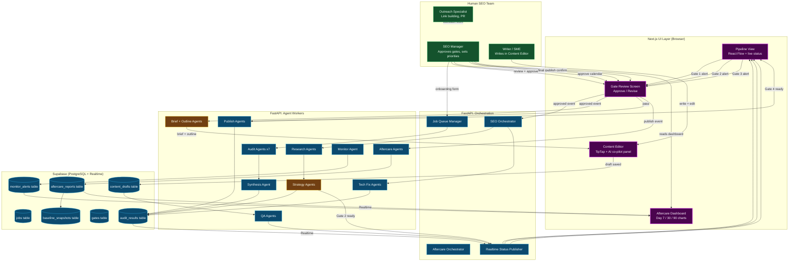

# Swimlane: To-Be — Agentic Human SEO Workflow with UI Layer

```mermaid
flowchart TD
    classDef ai fill:#0c4a6e,stroke:#38bdf8,color:#f0f9ff
    classDef hybrid fill:#713f12,stroke:#facc15,color:#fefce8
    classDef human fill:#14532d,stroke:#4ade80,color:#f0fdf4
    classDef gate fill:#450a0a,stroke:#ef4444,stroke-width:3px,color:#fef2f2
    classDef ui fill:#4a044e,stroke:#d946ef,stroke-width:2px,color:#fdf4ff

    subgraph UI["Next.js UI Layer (Browser)"]
        direction TB
        U1[Pipeline View\nReact Flow + live status]:::ui
        U2[Gate Review Screen\nApprove / Revise]:::ui
        U3[Content Editor\nTipTap + AI co-pilot panel]:::ui
        U4[Aftercare Dashboard\nDay 7 / 30 / 90 charts]:::ui
    end

    subgraph FASTAPIORCH["FastAPI: Orchestration"]
        direction TB
        OR1[Job Queue Manager]:::ai
        OR2[SEO Orchestrator]:::ai
        OR3[Aftercare Orchestrator]:::ai
        OR4[Realtime Status Publisher]:::ai
    end

    subgraph FASTAPIAGENTS["FastAPI: Agent Workers"]
        direction TB
        W1[Audit Agents x7]:::ai
        W2[Synthesis Agent]:::ai
        W3[Research Agents]:::ai
        W4[Strategy Agents]:::hybrid
        W5[Tech Fix Agents]:::ai
        W6[Brief + Outline Agents]:::hybrid
        W7[QA Agents]:::ai
        W8[Publish Agents]:::ai
        W9[Aftercare Agents]:::ai
        W10[Monitor Agent]:::ai
    end

    subgraph SUPABASE["Supabase (PostgreSQL + Realtime)"]
        direction TB
        DB1[(jobs table)]:::ai
        DB2[(audit_results table)]:::ai
        DB3[(content_drafts table)]:::ai
        DB4[(gates table)]:::ai
        DB5[(aftercare_reports table)]:::ai
        DB6[(baseline_snapshots table)]:::ai
        DB7[(monitor_alerts table)]:::ai
    end

    subgraph HUMAN["Human SEO Team"]
        direction TB
        HU1[SEO Manager\nApproves gates, sets priorities]:::human
        HU2[Writer / SME\nWrites in Content Editor]:::human
        HU3[Outreach Specialist\nLink building, PR]:::human
    end

    HU1 -->|onboarding form| OR1
    OR1 --> W1 --> W2 --> DB2
    DB2 -->|Realtime| OR4 --> U1
    U1 -->|Gate 1 alert| U2
    HU1 -->|review + approve| U2
    U2 -->|approved event| OR2
    OR2 --> W3 --> W4 --> DB2
    OR2 --> W5 --> DB2
    W4 -->|Gate 2 ready| OR4 --> U1
    U1 -->|Gate 2 alert| U2
    HU1 -->|approve calendar| U2
    U2 -->|approved event| W6
    W6 -->|brief + outline| U3
    HU2 -->|write + edit| U3
    U3 -->|draft saved| DB3
    DB3 --> W7 --> OR4 --> U1
    U1 -->|Gate 3 alert| U2
    HU1 -->|final read| U2
    U2 -->|pass| W8 --> DB2
    W8 -->|Gate 4 ready| U1
    HU1 -->|publish confirm| U2
    U2 -->|publish event| W9
    W9 --> DB5 --> DB6
    DB5 -->|Realtime| U4
    W10 --> DB7 --> U4
    HU1 -->|reads dashboard| U4
    HU3 -->|outreach work| HUMAN
```
